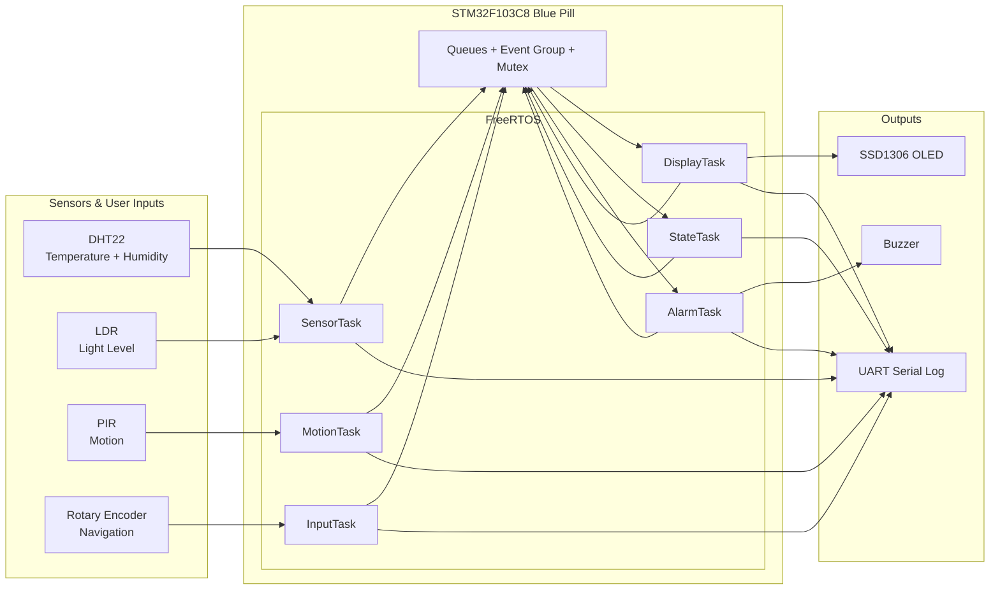
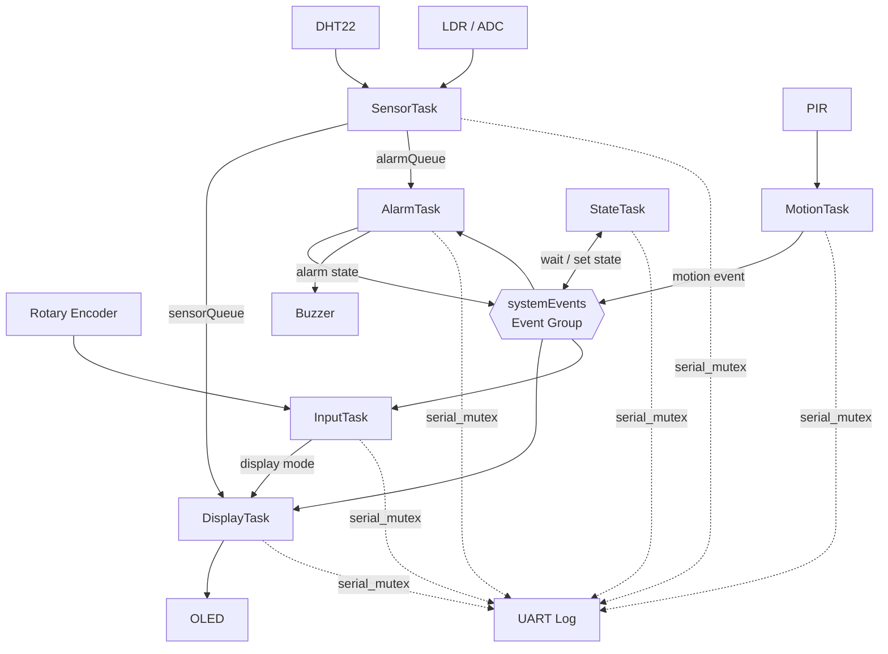
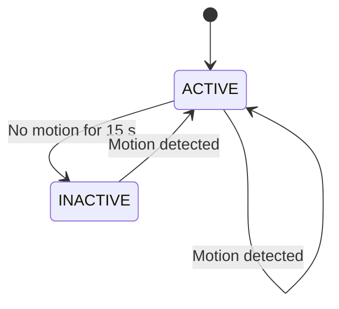
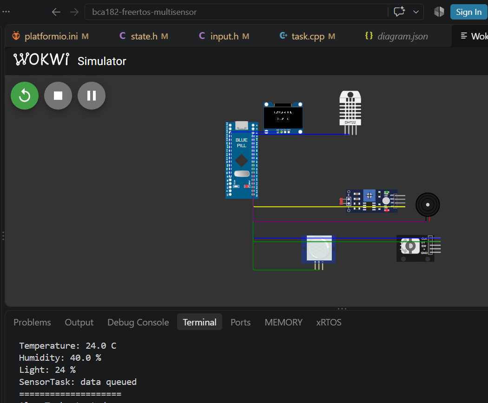
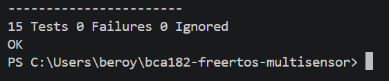
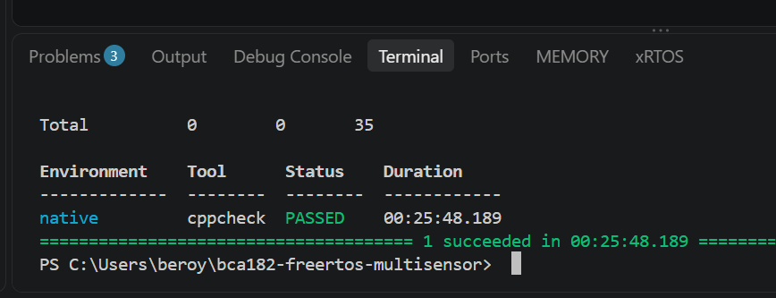

# BCA182 FreeRTOS Multisensor System on STM32 Blue Pill

A FreeRTOS-based room monitoring and multisensor system built for the **STM32F103C8 Blue Pill** using **PlatformIO**, **STM32Cube**, and native **FreeRTOS APIs**. The system reads temperature/humidity, light, and motion inputs; displays sensor information on an OLED; accepts rotary-encoder navigation; and manages temperature alarms and ACTIVE/INACTIVE behavior.

> **BCA182 – Embedded Systems Programming | Laboratory Activity**

## Project Overview

The application is designed as a concurrent embedded system where each major responsibility runs in its own FreeRTOS task.

- Reads **DHT22 temperature and humidity** data.
- Reads **LDR light level** through the STM32 ADC.
- Monitors a **PIR motion sensor**.
- Uses a **rotary encoder** to navigate OLED display pages.
- Displays sensor information on an **SSD1306 OLED over I2C**.
- Uses a **buzzer** for temperature alarms.
- Manages an **ACTIVE / INACTIVE** system state.
- Uses **queues and event groups** for inter-task communication.
- Protects shared serial output with the project's serial-mutex module.

## Learning Objectives

This project demonstrates how to:

- Structure an embedded application as cooperating FreeRTOS tasks.
- Separate hardware and application responsibilities into modules.
- Use FreeRTOS queues and event groups for inter-task communication.
- Implement an ACTIVE/INACTIVE state machine.
- Separate hardware-independent decision logic so it can be unit-tested on a PC.
- Verify the project with Unity unit tests and Cppcheck static analysis.

## System Architecture



**Figure 1. System architecture of the STM32F103C8 FreeRTOS multisensor application.**

## FreeRTOS Architecture



**Figure 2. FreeRTOS task architecture and inter-task communication.**

## Hardware / Simulated Components

| Component | Purpose |
|---|---|
| STM32F103C8 Blue Pill | Main microcontroller |
| DHT22 | Temperature and humidity sensing |
| LDR | Ambient-light measurement |
| PIR sensor | Motion detection |
| Rotary encoder | Display navigation |
| SSD1306 OLED | Sensor/status display |
| Buzzer | Temperature alarm output |

## Pin Configuration

| Device / Signal | STM32 Pin |
|---|---|
| LDR / ADC | PA0 |
| DHT22 DATA | PA1 |
| Buzzer | PA2 |
| PIR | PA3 |
| Encoder CLK | PA4 |
| Encoder DT | PA5 |
| UART TX/RX | PA9 / PA10 |
| OLED SCL | PB6 |
| OLED SDA | PB7 |

## Task Design

| Task | Responsibility | Priority |
|---|---|---:|
| `MotionTask` | Monitors PIR motion and signals motion events | 3 |
| `StateTask` | Manages ACTIVE/INACTIVE system state | 3 |
| `InputTask` | Processes rotary-encoder input and navigation | 3 |
| `SensorTask` | Reads DHT22 and LDR data | 2 |
| `AlarmTask` | Evaluates temperature alarm state and controls buzzer | 2 |
| `DisplayTask` | Owns OLED updates and selected display page | 1 |

The priorities are assigned so motion, input, and state management receive faster response than periodic sensor and display work.

## Inter-Task Communication

### Queues

Sensor information is passed between tasks through FreeRTOS queues so the producer and consumer responsibilities remain separated.

- `sensorQueue` carries sensor data for display processing.
- `alarmQueue` carries sensor data for alarm processing.
- Display navigation information is passed from the input logic to the display logic.

### Event Group

The project uses `systemEvents` to communicate system-level events and state information, including motion and active/inactive status.

### Serial Mutex

The serial-mutex module protects the shared UART output so diagnostic messages from concurrent tasks do not interfere with one another.

## Temperature Alarm Logic

```text
Temperature < 18 °C   → LOW_TEMPERATURE
18 °C to 30 °C        → NORMAL
Temperature > 30 °C   → HIGH_TEMPERATURE
```

The hardware-independent `evaluateTemperature()` logic is separated into `temperature_alarm.cpp`, allowing it to be tested directly on the host computer.

## State Machine



**Figure 3. ACTIVE/INACTIVE system-state behavior.**

## Repository Structure

```text
bca182-freertos-multisensor/
├── include/                  Project headers and FreeRTOS configuration
├── lib/
│   ├── FreeRTOS/             FreeRTOS source and port
│   └── Unity/                Unity test framework
├── src/
│   ├── main.cpp              Hardware initialization and scheduler startup
│   ├── sensors.cpp           SensorTask
│   ├── display.cpp           DisplayTask
│   ├── input.cpp             InputTask
│   ├── motion.cpp             MotionTask
│   ├── state.cpp             StateTask
│   ├── alarm.cpp             AlarmTask
│   ├── navigation.cpp        Display navigation logic
│   └── temperature_alarm.cpp Temperature alarm logic
├── test/
│   ├── test_main/            Unit-test suite
│   └── mocks/                Test-only support headers
├── docs/                     Documentation and evidence images
├── platformio.ini
├── diagram.json
├── wokwi.toml
└── README.md
```

## Getting Started

### Requirements

- Visual Studio Code
- PlatformIO IDE extension
- Wokwi extension for VS Code
- Git
- MSYS2 UCRT64 GCC/G++ for native unit testing on Windows

### Clone the Repository

```bash
git clone https://github.com/YOUR-USERNAME/bca182-freertos-multisensor.git
cd bca182-freertos-multisensor
```

Open the project folder in VS Code.

## Building the STM32 Firmware

Build the Blue Pill firmware with:

```powershell
& "$env:USERPROFILE\.platformio\penv\Scripts\platformio.exe" run -e bluepill_f103c8
```

The build should complete with `SUCCESS`.

## Running the Wokwi Simulation

1. Build the `bluepill_f103c8` firmware.
2. Confirm `.pio/build/bluepill_f103c8/firmware.elf` exists.
3. Open the Wokwi extension in VS Code.
4. Start the simulator.
5. Observe the OLED and serial monitor.
6. Change sensor values or simulate motion to exercise the application.

The Wokwi simulation is used for functional verification without requiring the physical STM32 board.

## Unit Testing

The project contains **15 Unity unit tests** covering temperature thresholds, display navigation, and system-state/event definitions.

### Test Breakdown

| Area | Tests |
|---|---:|
| Temperature alarm | 5 |
| Display navigation | 6 |
| System state / events | 4 |
| **Total** | **15** |

### Result

```text
15 Tests 0 Failures 0 Ignored
OK
```

The final host-side test run completed with **15/15 tests passing**.

## Static Analysis

Cppcheck was executed through PlatformIO:

```powershell
& "$env:USERPROFILE\.platformio\penv\Scripts\platformio.exe" check
```

### Result

| Severity | Count |
|---|---:|
| High | 0 |
| Medium | 0 |
| Low | 35 |

```text
PASSED
```

The low-severity findings were primarily unused-function and style observations while analyzing embedded modules. No high- or medium-severity findings were reported.

## Verification Summary

| Verification | Result |
|---|---|
| STM32 firmware build | SUCCESS |
| Unity unit tests | 15 / 15 passed |
| Cppcheck | PASSED |
| High-severity findings | 0 |
| Medium-severity findings | 0 |

## Evidence

### Wokwi Simulation

Place your Wokwi screenshot at:

```text
docs/images/wokwi.png
```

Then embed it with:

```markdown

```

### Unit Test Result

Place the terminal screenshot at:

```text
docs/images/unit-tests.png
```

```markdown

```

### Static Analysis Result

Place the Cppcheck screenshot at:

```text
docs/images/cppcheck.png
```

```markdown

```

## Contributors

### Renato G. Beroy

## Author

**Renato G. Beroy**

BCA182 FreeRTOS Multisensor Team  
Developed for academic laboratory work.